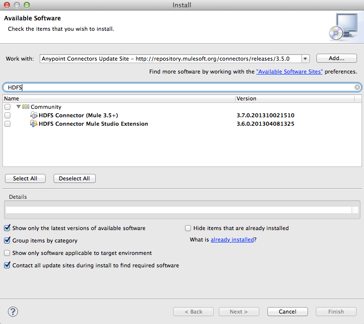
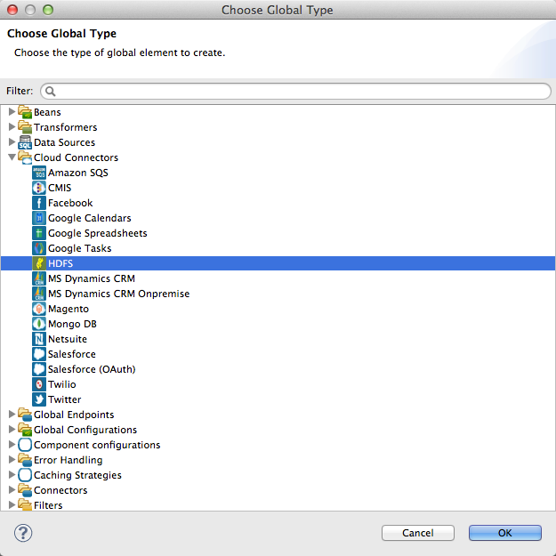
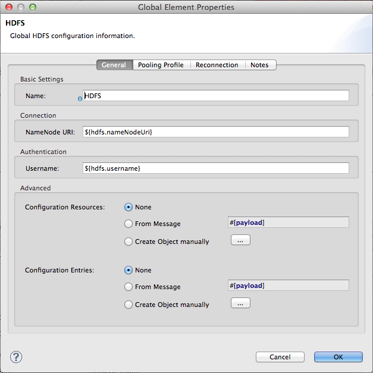
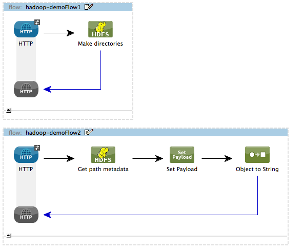
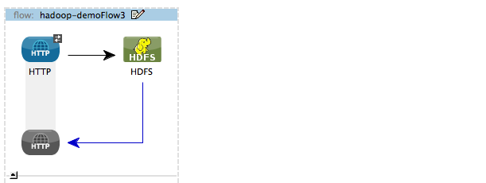
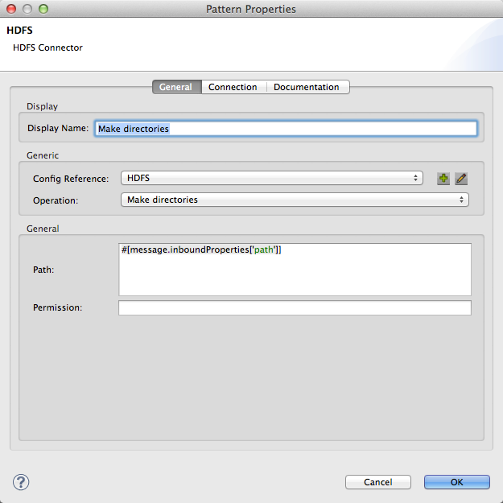
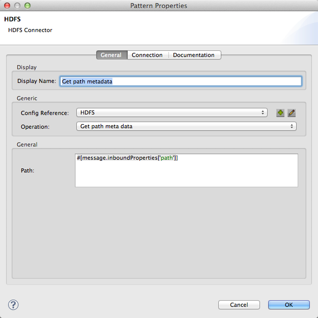
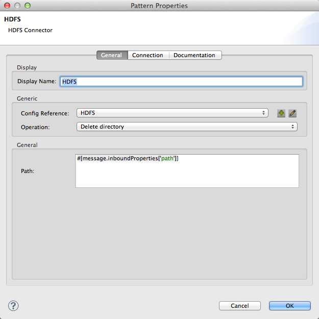

[Purpose](#purpose)

[Prerequisites](#prerequisites)

[Getting Anypoint Studio Ready](#getting-anypoint-studio-ready)

[Setting up the project](#setting-up-the-project)

[Building the flows](#building-the-flows)

[Other resources](#other-resources)

###Purpose

This document provides detailed instructions on how to install MuleSoft's HDFS connector and demonstrates how to build and run a simple demo application with Mule that creates a directory on HDFS, retrieves metadata about the directory, and deletes the directory.

###Prerequisites

In order to build and run this project you'll need,

*   A working [Apache Hadoop Server](http://hadoop.apache.org/).
*   Downloaded and installed [Anypoint Studio Community edition](http://www.mulesoft.org/download-mule-esb-community-edition).

###Getting Anypoint Studio Ready

If you haven't installed Anypoint Studio on your computer yet, it's time to download Anypoint Studio from this location: [http://www.mulesoft.org/download-mule-esb-community-edition](http://www.mulesoft.org/download-mule-esb-community-edition). You also have the option of downloading a 30 day trial of Mule Enterprise Edition from this location [http://www.mulesoft.com/mule-esb-enterprise](http://www.mulesoft.com/mule-esb-enterprise) if you want to evaluate and purchase the premium edition. This demo can be built using either community or enterprise edition. There is no specific installation that you need to run. Once you unzip the zip file to your desired location, you are ready to go. To install the HDFS connector, you can download and install it from Anypoint Connectors Update Site. To do that:

1. Open Anypoint Studio and from "Help" menu select "Install New Software...". Installation dialog box opens - Figure below.

2. From "Work with" drop down, select "Anypoint Connectors Update Site". The list of available connectors will be shown to you.

3. Find and select the HDFS connector in the list of available connectors, the tree structure that is shown. A faster way to find a specific connector is to filter the list by typing the name of the connector in the input box above the list. You can choose more than one connector to be installed at once.

4. When you are done selecting the connectors to be installed, click on "Next" button. Details of each connector are shown on the next page. Click on "Next" button again and accept the terms of the license agreement.

5. Click on "Finish" button. The connector is downloaded and installed onto Studio. You'll need to restart the Studio for the installation to be completed.

###Setting up the project

Now that you've got your Anypoint Studio up and running, it's time to work on the Mule App. Create a new Mule Project by clicking on "File \> New \> Mule Project". In the new project dialog box, the only thing you are required to enter is the name of the project. You can click on "Next" to go through the rest of pages.

The first thing to do in your new app is to configure the connection to HDFS. In the message flow editor, click on "Global Elements" tab on the bottom of the page. Then click on "Create" button on the top right of the tab. In the "Choose Global Element" type dialog box that opens select "HDFS" under "Connector Configuration" and click okay.

In the HDFS Configuration box that follows, set the NameNode URI to the name and port for your HDFS server. For example: "hdfs://localhost:9000"

The XML for the global element should look like this:

     <hdfs:config name="hdfs-conf" nameNodeUri="hdfs://localhost:9000" username="hduser" doc:name="HDFS"/>

###Building the flows

It's time to build the flows which create a directory, retrieve metadata about the directory, and delete the directory on HDFS.

**Create Directory flow:** This is the flow which creates a directory on the HDFS server. Start by dragging an HTTP endpoint from the palette onto the flow. Configure the Host, Port, and Path to "localhost", "8081", and "dircreate", respectively. This is the URL you will call to start the flow.
Then drag an HDFS Connector onto the flow after the HTTP endpoint. In the configuration window for the HDFS connector, select the previously created HDFS config from the Config Reference dropdown. Set the Operation to "Make directories", and set the Path field to "#[message.inboundProperties['path']]". Click okay.

This completes the Create Directory flow.

**Directory Metadata flow:** This is the flow which retrieves the metadata information about a particular directory. Start by dragging an HTTP endpoint from the palette onto the workspace (not onto a flow), creating a new flow. Configure the Host, Port, and Path to "localhost", "8081", and "metadata", respectively. This is the URL you will call to start the flow.
Then drag an HDFS Connector onto the flow after the HTTP endpoint. In the configuration window for the HDFS connector, select the previously created HDFS config from the Config Reference dropdown. Set the Operation to "Get path meta data", and set the Path field to "#[message.inboundProperties['path']]". Click okay.

Now drag a Set Payload Transformer onto the flow after the HDFS Connector. In the configuration window for the Set Payload Transformer, set the Value field to

    #[['1.path':message.inboundProperties['path'],'2.exists':flowVars['hdfs.path.exists']

and click okay. Then drag an Object to String transformer onto the flow after the Set Payload Transformer. This completes the Directory Metadata flow.

**Delete Directory flow:** This is the flow which deletes a directory on the HDFS server. Start by dragging an HTTP endpoint from the palette onto the flow. Configure the Host, Port, and Path to "localhost", "8081", and "dirdelete", respectively. This is the URL you will call to start the flow.
Then drag an HDFS Connector onto the flow after the HTTP endpoint. In the configuration window for the HDFS connector, select the previously created HDFS config from the Config Reference dropdown. Set the Operation to "Delete directory", and set the Path field to "#[message.inboundProperties['path']]". Click okay.

**Flow XML**

The final flow XML should look like this.

    <?xml version="1.0" encoding="UTF-8"?>

    <mule xmlns:hdfs="http://www.mulesoft.org/schema/mule/hdfs" xmlns:http="http://www.mulesoft.org/schema/mule/http" xmlns="http://www.mulesoft.org/schema/mule/core" xmlns:doc="http://www.mulesoft.org/schema/mule/documentation" xmlns:spring="http://www.springframework.org/schema/beans" version="EE-3.4.0" xmlns:xsi="http://www.w3.org/2001/XMLSchema-instance" xsi:schemaLocation="http://www.springframework.org/schema/beans http://www.springframework.org/schema/beans/spring-beans-current.xsd
    http://www.mulesoft.org/schema/mule/core http://www.mulesoft.org/schema/mule/core/current/mule.xsd
    http://www.mulesoft.org/schema/mule/http http://www.mulesoft.org/schema/mule/http/current/mule-http.xsd
    http://www.mulesoft.org/schema/mule/hdfs http://www.mulesoft.org/schema/mule/hdfs/current/mule-hdfs.xsd">
    	<hdfs:config name="hdfs-conf" nameNodeUri="hdfs://localhost:9000" username="hduser" doc:name="HDFS"/>
    	<flow name="hadoop-demoFlow1" doc:name="hadoop-demoFlow1">
    		<http:inbound-endpoint exchange-pattern="request-response" host="localhost" port="8081" path="dircreate" doc:name="HTTP"/>
    		<hdfs:make-directories config-ref="hdfs-conf" path="#[message.inboundProperties['path']]" doc:name="Make directories"/>
    	</flow>
    	<flow name="hadoop-demoFlow2" doc:name="hadoop-demoFlow2">
    		<http:inbound-endpoint exchange-pattern="request-response" host="localhost" port="8081" path="metadata" doc:name="HTTP"/>
    		<hdfs:get-metadata config-ref="hdfs-conf" path="#[message.inboundProperties['path']]" doc:name="Get path metadata"/>
    		<set-payload value="#[['1.path':message.inboundProperties['path'],'2.exists':flowVars['hdfs.path.exists']" doc:name="Set Payload"/>
    		<object-to-string-transformer doc:name="Object to String"/>
    	</flow>
    	<flow name="hadoop-demoFlow3" doc:name="hadoop-demoFlow3">
    		<http:inbound-endpoint exchange-pattern="request-response" host="localhost" port="8081" path="dirdelete" doc:name="HTTP"/>
    		<hdfs:delete-directory config-ref="hdfs-conf" path="#[message.inboundProperties['path']]" doc:name="HDFS"/>
    	</flow>
    </mule>

**Testing the app**

Now it's time to test the app. Run the app in Anypoint Studio and open a browser window. Visit [http://localhost:8081/dircreate?path=muledir](http://localhost:8081/dircreate?path=muledir). This will create a directory on the HDFS server.
Now visit [http://localhost:8081/metadata?path=muledir](http://localhost:8081/metadata?path=muledir). This will retrieve metadata about the recently created directory.
Now visit [http://localhost:8081/dirdelete?path=muledir](http://localhost:8081/dirdelete?path=muledir). This will delete the previously created directory.

###Other resources

For more information on:

●     Mule platform and how to build Mule apps, please visit  [http://www.mulesoft.org/documentation](http://www.mulesoft.org/documentation/display/current/Home)
